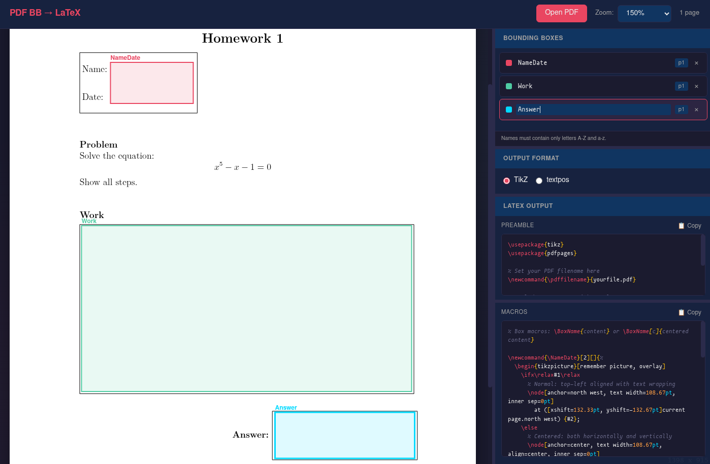

# Latex Bounding Box Aligner

This tool is a single HTML + Javascript webpage which helps you overlay custom LaTeX content onto existing PDF pages. Common use cases include:

- **Homework answers**: fill in solutions on a PDF with specific answer boxes
- **Form filling**: add typed content to PDF forms
- **General annotations**: place text, equations, or diagrams at precise locations on any PDF

The tool does **not** modify your PDF. Instead, it generates LaTeX macros that position content at exact coordinates when you include the PDF in a LaTeX document which you compile yourself. You write the content and LaTeX will place it within that box.

See [tutorial.md](./tutorial.md) for a complete tutorial.

**Here's the website with bounding boxes added:**

**The resulting PDF:** [demo-annotated.pdf](./demo/demo-annotated.pdf)

**The underlying LaTeX to generate the PDF:** [demo-annotated.tex](./demo/demo-annotated.tex)

## Demo

To see how the demo was implemented see `demo-annotated.tex` and `demo-annotated.pdf`. You can try yourself by opening `demo.pdf` in the app.
